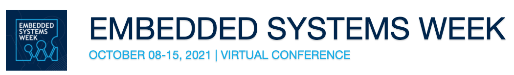

# ESweek2021_educationclassA3



This is the repository that includes the code material for the ESweek 2021 for the Education Class Lecture A3 "Learn to Drive (and Race!) Autonomous Vehicles"

Lecture videos: [Youtube Playlist](https://youtube.com/playlist?list=PL7rtKJAz_mPfco1w8SBygmroa27TyFSLy)

Lecturers:
* [Johannes Betz](https://joebetz.science/)
* [Rahul Mangharam](https://www.seas.upenn.edu/~rahulm/)

The following code was tested on both MacOS (Big Sur, Monterey) and Linux (Ubuntu 18.04, 20.04)
# Environment Installation guide

1. Start by installing a Virtual Environment (`virtualenv`) with Python 3.8 in the repository:

- Install the `virtualenv` python3 package
```
pip3 install virtualenv
```

- Create a virtual environment
```
virtualenv venv
```

- Enable the virtual environment
```
source venv/bin/activate
```

2. Install the required python packages within the`virtualenv` with the following command:

```
pip3 install -r requirements.txt
```
3. Install the F1TENTH gym environment while in the root folder of this repository by running the following command:
```bash
$ pip3 install -e gym/
```
4. For more information about the F1TENTH Gym environment you can have a look at the the [documentation](https://f1tenth-gym.readthedocs.io/en/latest/) here.
# Run the ESWeek Lecture

## 1. Avoid the Crash: Follow the Gap

1. Change to the Folder 01_Follow_The_Gap

2. To experience the Follow the Gap algorithm, run the following command.
```bash
$ python3 FollowTheGap.py
```

3. You will see the simulation starting and a new windows with the simulation environment is popping up. This algorithm is running on a map that has obstacles included and you see the algorithm is avoiding these obstacles.

4. You can adjust the Follow The Gap parameter in the drivers.py file


## 2. Follow the Raceline: Pure Pursuit

1. Change to the Folder 02_Pure_Pursuit

2. To experience the Pure Pursuit algorithm, run the following command.
```bash
$ python3 PurePursuit.py
```

3. You will see the simulation starting and a new windows with the simulation environment is popping up. This algorithm is following a precalculated racline which is displayed in the simulation environment.

4. You can adjust the Pure Pursuit parameter directly in the PurePursuit.py file

5. To get a minimum curvature or minimum time global optimal raceline we recommend that you use the methods and code that is displaye [here](https://github.com/TUMFTM/global_racetrajectory_optimization)

## 3. Race and Overtake: Graph Based Planner

1. Change to the Folder 03_GraphBasedPlanner

2. To experience the Graph based planner algorithm, run the following command.
```bash
$ python3 GraphPlanner_MultiVehiclepy.py
```

3. You will see the simulation starting and a new windows with the simulation environment is popping up. In addition first of all the graph for the whole racetrack is created. This algorithm is following a precalculated racline which while avoiding and overtaking obstacles - fast and safe.

4. A detailed documentation and explanation of the Graph Based Planner can be found [here](https://graphbasedlocaltrajectoryplanner.readthedocs.io/).


# Known issues
- On MacOS Big Sur and above, when rendering is turned on, you might encounter the error:
```
ImportError: Can't find framework /System/Library/Frameworks/OpenGL.framework.
```
You can fix the error by installing a newer version of pyglet:
```bash
$ pip3 install pyglet==1.5.11
```
And you might see an error similar to
```
gym 0.17.3 requires pyglet<=1.5.0,>=1.4.0, but you'll have pyglet 1.5.11 which is incompatible.
```
which could be ignored. The environment should still work without error.

# References
For this repository we are using the theoretical foundations, images and code from the following papers. If you find our work useful in your research, please consider citing:

* J. Betz, A. Wischnewski, A. Heilmeier, F. Nobis, T. Stahl, L. Hermansdorfer, B. Lohmann, M. Lienkamp "What we can learn from autonomous racing",2018, Springer [(PDF)](https://www.researchgate.net/publication/327892743_What_can_we_learn_from_autonomous_level-5_motorsport_chassistech_plus)

* M. O’Kelly, H. Zheng, D. Karthik, R. Mangharam "F1TENTH: An Open-source Evaluation Environment for Continuous Control and Reinforcement Learning" in Proceedings of the NeurIPS 2019 Competition and Demonstration Track, PMLR 123:77-89, 2020. [(PDF)](https://proceedings.mlr.press/v123/o-kelly20a.html)

* T. Stahl, A. Wischnewski, J. Betz, and M. Lienkamp,
“Multilayer Graph-Based Trajectory Planning for Race Vehicles in Dynamic Scenarios,”
in 2019 IEEE Intelligent Transportation Systems Conference (ITSC), Oct. 2019, pp. 3149–3154. [(PDF)](https://arxiv.org/pdf/2005.08664>`)

* A. Heilmeier, A. Wischnewski, L. Hermansdorfer, J. Betz, M. Lienkamp, B. Lohmann\
"Minimum Curvature Trajectory Planning and Control for an Autonomous Racecar" Vehicle System Dynamics, vol. 58, no. 10, pp. 1497–1527, Jun. 2019,
[(PDF)](https://www.tandfonline.com/doi/abs/10.1080/00423114.2019.1631455?journalCode=nvsd20)
